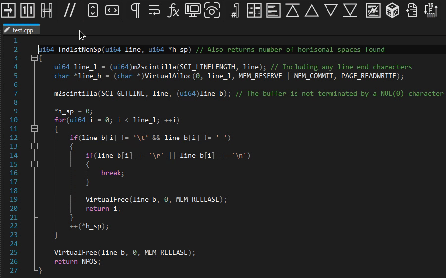
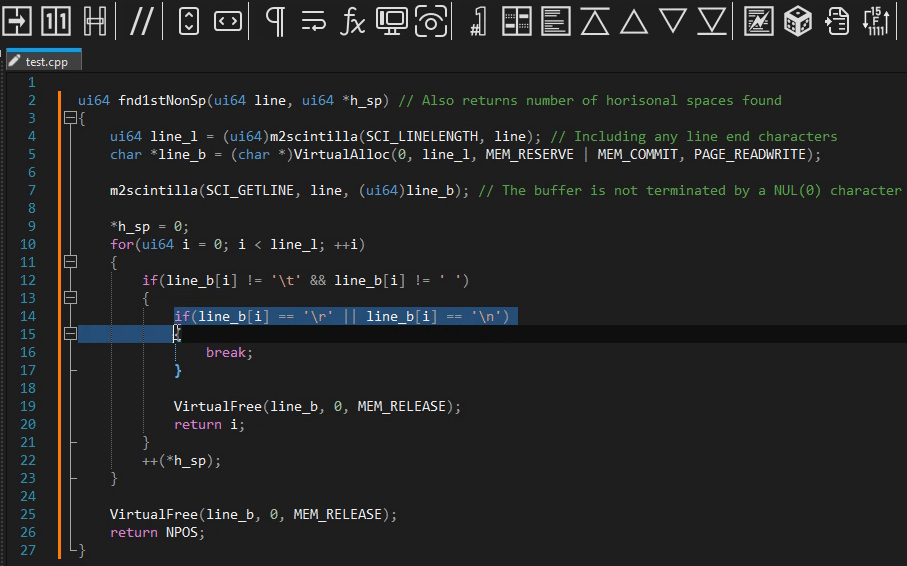
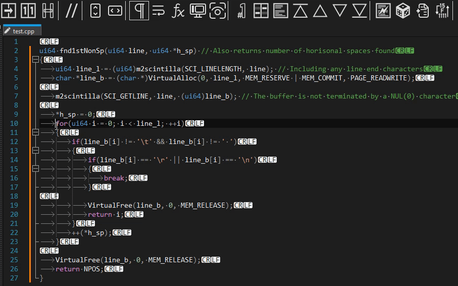
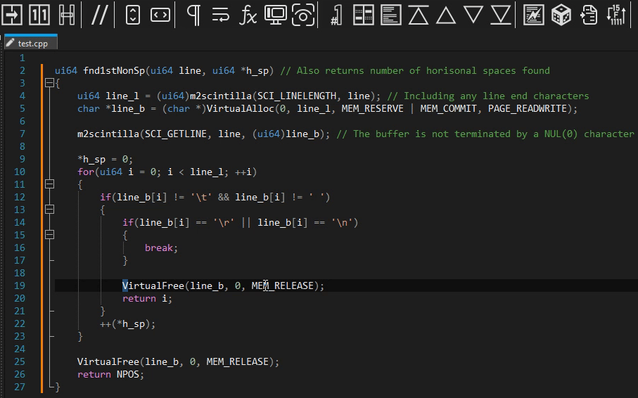
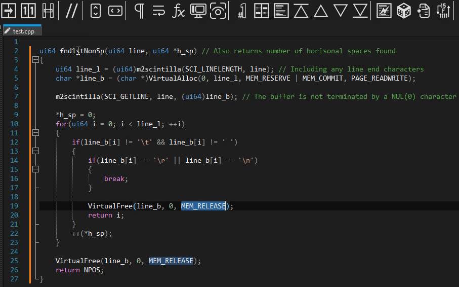

# Comment Toggler

This is unified solution to any automated source code commenting problems you might have with Notepad++ (and even other editors).
Comment Toggler uses only **single button** (command) to acomplish all the range of commenting you might need. It automatically determines what type of comment to make or to remove.

Plug-in features:
* Does not insert space in front of the comment (this can lead to confusion between commented-out code and actual manual comments). *Exception: REM batch*
* Supports all the built in languages and even user defined languages*
* Can do simple single line comments without selection:

<ul><li>Preserves indentation in the commented code block:</li></ul>

<ul><li>Fixes some indentation inconsistencies:</li></ul>

<ul><li>Supports block comments:</li></ul>

<ul><li>Supports multiple selections:</li></ul>

<ul><li>With every type of comment at the same time:</li></ul>

**Note: I use `langs.xml` file in `AppData\Roaming\Notepad++` to get comment markers. If you want that space in front of the comments or want to use different style of comment mark, edit your `langs.xml` file. Comment markers of up to 31 characters are supported. User defined language file must have defined extention to be recoginised. I couldn't find any way to get the actual name of currently active UDL, so the plug-in just scans file extension.*
